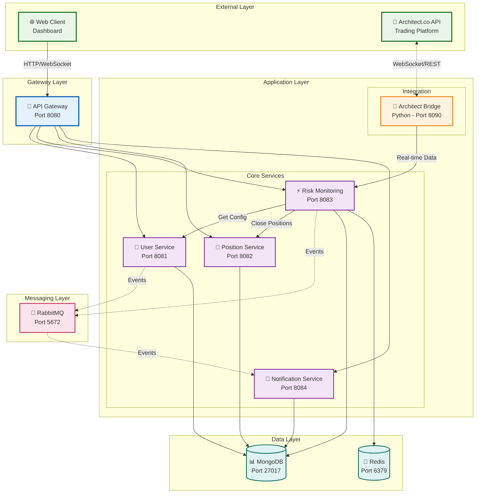

# Risk Management Service for Architect Trading System

A microservices-based real-time risk monitoring platform integrated with Architect.co trading API. The system monitors trading accounts, analyzes risk metrics, and automatically triggers protective actions when risk limits are violated.

## 🎯 Project Overview

This system implements a comprehensive risk management solution that:
- Monitors multiple trading accounts in real-time
- Enforces user-defined risk limits (daily and maximum)
- Automatically closes positions when limits are breached
- Provides real-time notifications and audit logs
- Integrates with Architect.co trading platform

### Key Features
- **Real-time Monitoring**: WebSocket-based balance tracking with <2s detection
- **Automated Risk Management**: Automatic position closure and account blocking
- **Event-driven Architecture**: RabbitMQ for reliable message delivery
- **Comprehensive Logging**: Mandatory audit trails and system logs
- **Scalable Microservices**: Independent services with clear responsibilities

## 📋 Requirements Implementation

### 1. User Configuration ✅
- API key and secret management with encryption
- Initial balance tracking
- Configurable risk limits (percentage or absolute)
- Client configuration via REST API

### 2. Real-time Monitoring ✅
- WebSocket connection to Architect.co API
- Continuous balance polling every 2 seconds
- Daily and cumulative PnL tracking
- MongoDB persistence for audit trails

### 3. Risk Checks ✅
- **Daily Risk Trigger**: Blocks trading until next day
- **Max Risk Trigger**: Permanently blocks account
- Configurable thresholds (absolute values or percentages)

### 4. Automated Actions ✅
- Fetch and close all open positions
- Update account status in database
- Block trading (daily or permanent)
- Comprehensive error handling

### 5. Notifications ✅
- Mandatory system logging
- Optional channels: Email, Slack, WebSocket
- Event-driven notification system
- Audit trail preservation

## 🏗️ System Architecture

> 📊 **Complete Visual Diagrams**: For all detailed architecture diagrams, see [architecture-diagram.md](./architecture-diagram.md)

### Main Architecture - Layered View



### Core Components
- **API Gateway (8080)**: Entry point and service routing
- **User Service (8081)**: Configuration and credential management  
- **Risk Monitoring (8083)**: Core risk analysis engine
- **Position Service (8082)**: Trading position management
- **Notification Service (8084)**: Multi-channel alerts
- **Architect Bridge (8090)**: External API integration

## 🧩 Service Breakdown

### 📟 API Gateway (Port 8080)
**Purpose**: Centralized entry point and routing
- Route management to all microservices
- Authentication and authorization
- Circuit breaker pattern for resilience
- Load balancing and rate limiting

### 👥 User Service (Port 8081)
**Purpose**: User and configuration management
- User registration and authentication
- API credential storage (encrypted)
- Risk limit configuration
- Publishes user registration events to RabbitMQ

**Key Events**:
- `user.registrations` → Triggers automatic monitoring setup
- `user.updates` → Updates risk monitoring parameters

### 🎯 Risk Monitoring Service (Port 8083)
**Purpose**: Core risk analysis and enforcement engine
- Real-time balance monitoring via WebSocket
- Risk limit calculation and violation detection
- Automated action execution (position closure, blocking)
- Event publishing for notifications

**Key Events**:
- Listens to: `user.registrations`, `user.updates`
- Publishes to: `risk.violation`, `notification.queue`

### 💼 Position Service (Port 8082)
**Purpose**: Trading position management
- Integration with Architect.co API
- Order placement and cancellation
- Position closure execution
- Risk action implementation

### 📢 Notification Service (Port 8084)
**Purpose**: Centralized notification handling
- Multi-channel notification delivery
- Mandatory audit logging
- System event processing
- Historical notification tracking

### 🌐 Architect Bridge (Python - Port 8090)
**Purpose**: External API integration bridge
- WebSocket connection to Architect.co
- Real-time data polling every 2 seconds
- Bridge between Python SDK and Java services
- Data format translation and forwarding

### 📚 Shared Library
**Purpose**: Common utilities and models
- DTOs and data models
- Feign clients for inter-service communication
- Event models for RabbitMQ
- Audit logging utilities

## 🔄 Event Flow Architecture

### User Registration Flow
```
1. API Gateway → User Service (POST /api/users)
2. User Service → MongoDB (Save user config)
3. User Service → RabbitMQ (Publish user.registration event)
4. Risk Monitoring Service ← RabbitMQ (Listen user.registration)
5. Risk Monitoring Service → Initialize monitoring
6. Risk Monitoring Service ← Architect Bridge (Start WebSocket)
```

### Risk Violation Flow
```
1. Architect Bridge → Real-time balance data
2. Risk Monitoring Service → Risk calculation
3. Risk Monitoring Service → Violation detection
4. Risk Monitoring Service → Position Service (Close positions)
5. Risk Monitoring Service → MongoDB (Update status)
6. Risk Monitoring Service → RabbitMQ (Publish violation event)
7. Notification Service ← RabbitMQ (Process notification)
8. Multiple channels ← Notification Service (Send alerts)
```

## 🛠️ Technology Stack

### Backend Services
- **Java 17** with Spring Boot 3.1.0
- **Spring Cloud Gateway** for API routing
- **Spring WebSocket** for real-time communication
- **Spring Data MongoDB** for persistence
- **RabbitMQ** for event-driven messaging
- **Feign Client** for inter-service communication

### External Integration
- **Python 3.13** with FastAPI
- **architect-py** SDK for trading API
- **WebSocket** for real-time data streaming

### Infrastructure
- **MongoDB** for data persistence
- **Redis** for caching and sessions
- **RabbitMQ** for message queuing
- **Docker Compose** for local development

## 🚀 Getting Started

### Prerequisites
- Java 17+
- Python 3.13+
- Docker and Docker Compose
- Maven 3.6+

### Quick Start

1. **Clone and setup the repository**:
```bash
git clone <repository-url>
cd springboot-interview
```

2. **Start infrastructure services**:
```bash
docker-compose up -d mongodb rabbitmq redis
```

3. **Build all Java services**:
```bash
# Build shared library first
cd shared-lib && mvn clean install

# Build all services
mvn clean install
```

4. **Start the Python bridge**:
```bash
cd architect-bridge
pip install -r requirements.txt
python main.py
```

5. **Start Java services**:
```bash
# Start each service in separate terminals
cd api-gateway && mvn spring-boot:run
cd user-service && mvn spring-boot:run  
cd risk-monitoring-service && mvn spring-boot:run
cd position-service && mvn spring-boot:run
cd notification-service && mvn spring-boot:run
```

### Alternative: Docker Compose (All Services)
```bash
# Start everything with Docker
docker-compose up -d --build
```

### Service Health Checks
```bash
# Check all services are running
curl http://localhost:8080/actuator/health  # API Gateway
curl http://localhost:8081/actuator/health  # User Service
curl http://localhost:8082/actuator/health  # Position Service
curl http://localhost:8083/actuator/health  # Risk Monitoring
curl http://localhost:8084/actuator/health  # Notification Service
curl http://localhost:8090/health           # Python Bridge
```

## 📊 API Usage Examples

### 1. Register a New User
```bash
curl -X POST http://localhost:8080/api/users \
  -H "Content-Type: application/json" \
  -d '{
    "clientId": "user123",
    "apiKey": "your_api_key",
    "apiSecret": "your_api_secret", 
    "initialBalance": 100000,
    "maxRisk": {"type": "percentage", "value": 30},
    "dailyRisk": {"type": "absolute", "value": 5000}
  }'
```

### 2. Monitor Risk Status
```bash
# Get real-time risk status
curl http://localhost:8080/api/risk/status/user123

# Get monitoring history
curl http://localhost:8080/api/risk/history/user123
```

### 3. WebSocket Real-time Updates
```javascript
// Connect to real-time risk updates
const ws = new WebSocket('ws://localhost:8083/ws/risk');
ws.onmessage = (event) => {
  const data = JSON.parse(event.data);
  console.log('Risk update:', data);
};
```

## 🔧 Configuration

### Environment Variables
```bash
# MongoDB Configuration
MONGO_URI=mongodb://localhost:27017
MONGO_DB=risk_management

# RabbitMQ Configuration  
RABBITMQ_HOST=localhost
RABBITMQ_PORT=5672
RABBITMQ_USERNAME=admin
RABBITMQ_PASSWORD=password123

# Redis Configuration
REDIS_HOST=localhost
REDIS_PORT=6379

# Architect API Configuration
ARCHITECT_API_BASE_URL=https://api.architect.co
```

### Service Ports
- **API Gateway**: 8080
- **User Service**: 8081  
- **Position Service**: 8082
- **Risk Monitoring**: 8083
- **Notification Service**: 8084
- **Architect Bridge**: 8090

## 📋 Testing

### Unit Tests
```bash
# Run tests for all services
mvn test

# Run tests for specific service
cd user-service && mvn test
```

### Integration Tests
```bash
# Test API endpoints
python test-risk-scenario.py

# Test WebSocket connection
curl -X POST http://localhost:8083/api/risk/simulate-violation \
  -H "Content-Type: application/json" \
  -d '{"clientId": "user123", "violationType": "DAILY_RISK"}'
```

### Manual Testing Scenarios
1. **User Registration**: Register user and verify monitoring starts
2. **Risk Violation**: Simulate balance drops to trigger risk limits
3. **Position Closure**: Verify automatic position closure on violations
4. **Notifications**: Check all notification channels work correctly

## 📝 Monitoring and Logging

### Log Files
- **Mandatory Audit**: `*/logs/mandatory-audit.log`
- **System Logs**: `*/logs/system.log`
- **Application Logs**: Console output for each service

### Key Metrics to Monitor
- Balance update frequency (should be ~2 seconds)
- Risk violation detection latency
- Position closure success rate
- RabbitMQ message processing times
- WebSocket connection stability

## 🔒 Security Considerations

- API credentials encrypted in MongoDB
- Inter-service communication via internal network
- Rate limiting on API Gateway
- Authentication tokens for external API access
- Audit logs for compliance requirements

## 🚨 Troubleshooting

### Common Issues

**Services not starting**:
- Verify MongoDB and RabbitMQ are running
- Check port availability (8080-8090)
- Ensure Java 17+ is installed

**WebSocket connection failures**:
- Check Python bridge is running (port 8090)
- Verify Architect API credentials are valid
- Monitor network connectivity

**Risk monitoring not working**:
- Verify user registration completed successfully
- Check RabbitMQ message queues for backlogs
- Monitor risk-monitoring-service logs

### Debug Commands
```bash
# Check RabbitMQ queues
curl -u admin:password123 http://localhost:15672/api/queues

# Monitor MongoDB collections
mongosh --eval "use risk_management; db.account_monitoring.find()"

# Check service logs
docker-compose logs -f risk-monitoring-service
```

## 🤝 Contributing

1. Fork the repository
2. Create feature branch (`git checkout -b feature/amazing-feature`)
3. Commit changes (`git commit -m 'Add amazing feature'`)
4. Push to branch (`git push origin feature/amazing-feature`)
5. Open a Pull Request

## 📄 License

This project is part of a technical interview challenge for trading risk management systems.

---

**Built with ❤️ for safe and reliable trading risk management**
