# Risk Management System - Architecture Diagrams

## System Overview

### Main Architecture - Layered View

### Simplified Data Flow

```mermaid
flowchart LR
    subgraph "External"
        A[🏢 Architect.co]
        C[🌐 Client]
    end
    
    subgraph "Processing"
        B[🐍 Bridge]
        R[⚡ Risk Engine]
        P[💼 Positions]
        N[📢 Notifications]
    end
    
    subgraph "Storage"
        D[(📊 Database)]
        Q[🐰 Queue]
    end
    
    A -->|Real-time| B
    B -->|Balance| R
    R -->|Violation| P
    R -->|Alert| N
    R --> D
    R --> Q
    Q --> N
    C <--> R
    
    style A fill:#ffcdd2
    style B fill:#fff3e0
    style R fill:#e8f5e8
    style P fill:#e3f2fd
    style N fill:#f3e5f5
    style D fill:#e0f2f1
    style Q fill:#fce4ec
```

## RabbitMQ Event Flow

## User Registration Flow

## Risk Violation Flow

## Data Flow Architecture

```mermaid
graph TD
    %% Data Sources
    API[Architect.co API]
    
    %% Processing Layers
    subgraph "Data Ingestion"
        BRIDGE[Python Bridge<br/>• WebSocket Client<br/>• Data Polling<br/>• Format Translation]
    end
    
    subgraph "Risk Processing"
        RISK[Risk Engine<br/>• Balance Tracking<br/>• Risk Calculation<br/>• Violation Detection]
    end
    
    subgraph "Action Execution"
        POS[Position Manager<br/>• API Integration<br/>• Order Closure<br/>• Status Updates]
    end
    
    subgraph "Notification Layer"
        NOTIF[Notification Hub<br/>• Multi-channel<br/>• Audit Logging<br/>• Event History]
    end
    
    subgraph "Data Storage"
        MONGO[(MongoDB<br/>• User Configs<br/>• Monitoring Data<br/>• Audit Logs)]
        REDIS[(Redis<br/>• Real-time Cache<br/>• Session Data)]
    end
    
    %% Data Flow
    API -->|Real-time Data| BRIDGE
    BRIDGE -->|Processed Data| RISK
    RISK -->|Risk Events| POS
    RISK -->|Notifications| NOTIF
    
    %% Storage
    RISK --> MONGO
    RISK --> REDIS
    POS --> MONGO
    NOTIF --> MONGO
    
    %% Styling
    classDef processing fill:#e1f5fe,stroke:#01579b,stroke-width:2px
    classDef storage fill:#e8f5e8,stroke:#1b5e20,stroke-width:2px
    classDef external fill:#f3e5f5,stroke:#4a148c,stroke-width:2px
    
    class BRIDGE,RISK,POS,NOTIF processing
    class MONGO,REDIS storage
    class API external
```

## Technology Stack

## Deployment Architecture

